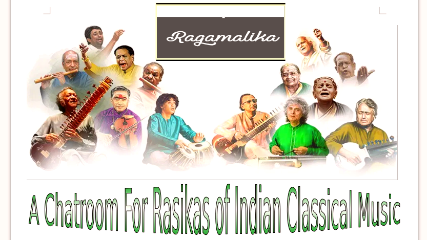

# Namaskar to All

# Welcome To:

# Date of creation of the room : 15 / 01 / 2020 ,Wednesday

# About the room :

Ragamalika (pronounced rāgamālika) , is the chat room created(Music Fans SE) with the intention of dedication to the [Music of India](https://en.wikipedia.org/wiki/Music_of_India) with more priority to [Indian Classical Music](https://en.wikipedia.org/wiki/Indian_classical_music) .

## Chatroom Rules

## On-Topic :

-   Theoretical and Technical aspect of Indian Classical Music.
-   Discussion on other genres in [Music of India](https://en.wikipedia.org/wiki/Music_of_India) , other than Indian Classical Music.
-   Music appreciation
-   Learning

## Allowed :

-   As the part of vocal training purposes ,sharing of vocal recordings are allowed here.
-   Presentation of own work are allowed here ( both instrumental and vocal).
-   Discussion on the previous questions once answered on the main sites are indian-classical , raga , filmi are allowed here.

## Not -Allowed

-   This room should not be used for any kind of Entertainment purposes.
-   Unnecessary comments/ starring (star as interest) to a particular post are considered as indisciplinary actions .
(unnecessary starring should be avoided : If it doesn’t add anything educational/new with the purpose of functioning of this chat-room).
-   Discussion on other Music genres which does not come under the [Music of India](https://en.wikipedia.org/wiki/Music_of_India) will not allow here.It should be done in other rooms of Music Fans SE.
-   Discussion on the formation of answers on questions that just posted on the main site ( question -answering) ( indian-classical , raga , filmi ) are not allowed here.
-   Unnecessary pings to people without having any reasons will consider as indisciplinary actions.
-   Presentation of own works shared by one user will not allowed to share further without the permission of respective owners.
